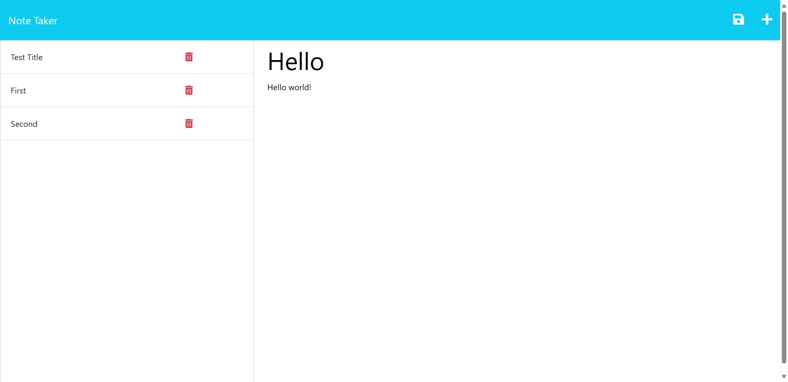
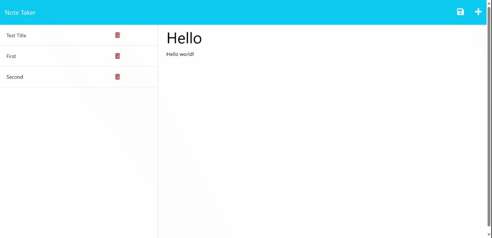

# Task-Note-Tracker

Welcome to Task-Note-Tracker – your web-based solution to effortlessly create, view, and delete notes while ensuring they remain stored for future access.

## Table of Contents

- [Description](#description)
- [Live Deployment](#live-deployment)
- [Features](#features)
  - [User-Friendly Interface](#user-friendly-interface)
  - [Persistent Storage](#persistent-storage)
  - [Instant Access](#instant-access)
  - [Deletion Capability](#deletion-capability)
- [Installation](#installation)
- [Usage](#usage)
- [Technologies Used](#technologies-used)
- [Demo](#demo)
- [Contributors](#contributors)
- [Contact](#contact)
- [License](#license)

## Description

The Task-Note-Tracker application ensures that you can jot down your thoughts, tasks, or important information in a seamless manner, right from your web browser. With the ability to review and delete past notes, managing your day-to-day tasks or fleeting ideas has never been easier.

## Live Deployment

Experience the Task-Note-Tracker in action by visiting the live application: [Task-Note-Tracker on Heroku](https://task-note-tracker-f1ff83d55715.herokuapp.com/).

## Features

### User-Friendly Interface

**Simple and straight to the point.** The design ensures that you spend more time noting down your ideas rather than trying to navigate through complex options. The intuitive UI guarantees a smooth user experience.

### Persistent Storage

**Your notes are here to stay.** Notes are stored in a `db.json` file, ensuring they remain intact even after you've closed the browser or restarted your server. No more fear of losing those important jot-downs.

### Instant Access

**Click to view.** Easily access any of your saved notes with just a single click. This provides a quick review capability, ensuring you can always refer back to previous entries.

### Deletion Capability

**Keep it clean.** Finished with a task or a note? The easy-to-spot delete button ensures you can keep your notes list organized and clutter-free.

## Installation

To start using Task-Note-Tracker:

1. Clone this repository: `git clone https://github.com/username/Task-Note-Tracker.git`
2. Navigate to the project directory: `cd Task-Note-Tracker`
3. Install necessary dependencies: `npm install`
4. Start the server: `node server.js`

## Usage

- Launch the application by navigating to the URL provided or [localhost:3000](http://localhost:3000) if running locally.
- Click on the "+" icon to create a new note.
- View past notes by clicking on any title from the list.
- Delete notes using the bin icon next to each note.

## Technologies Used

Task-Note-Tracker is built using:

- 
- 

## Demo

Explore Task-Note-Tracker's simplicity and functionality:

## Contributors

This efficient application was meticulously crafted by [Arsalan Bardsiri](https://github.com/arsalanbardsiri).

## Contact

For feedback, inquiries, or collaboration:

- Email: <arsalanbardsiri@gmail.com>
- GitHub: [github.com/arsalanbardsiri](https://github.com/arsalanbardsiri)

## License

Task-Note-Tracker is licensed under the [MIT License](LICENSE).

Thank you for choosing Task-Note-Tracker. Stay organized!